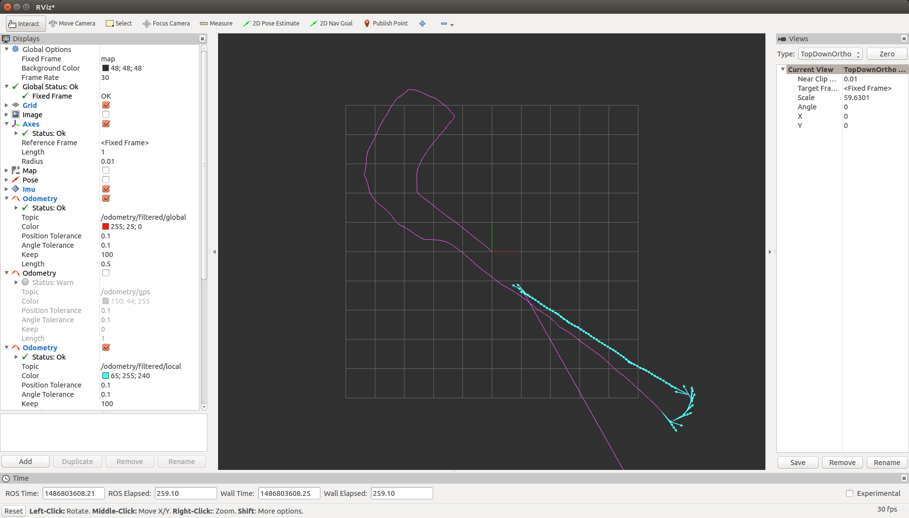

##RedBot Odom

Using the [SparkFun RedBot](https://www.sparkfun.com/products/12649) as the development platform and ros [differential\_drive](https://github.com/sterlingm/differential-drive) ported for ROS indigo, as well as [ros\_android\_sensors](https://github.com/yycho0108/ros_android_sensors) from my previous development, and finally [robot\_localization](http://docs.ros.org/kinetic/api/robot_localization/html/index.html), this project tackles robot localization through encoder-based odometry sensor fusion with IMU and GPS.

### Localization Demo:



The test was performed in the second floor of the Academic center, in the hallway between the entrance to the Large Project Building and the Robotics Lab.

At the end of the test, the localization node failed to meet the update rate and began to act erratically. Before then, however, the estimates were accurate and reliable.

### How To Install

```bash
cd ~/catkin_ws/src
git clone https://github.com/yycho0108/redbot_odom.git 
catkin_make --pkg redbot_odom
```

Alternatively, in case your build environment is catkin tools:

```bash
catkin build redbot_odom
```

### How To Run

1. Run roscore:

	```bash
	roscore
	```
2. Run the Application as explained [here](https://github.com/yycho0108/ros_android_sensors)

3. Launch the Odometry/Control Interface with the Arduino:

	```bash
	roslaunch redbot_odom odom.launch
	```

	This will instantiate a rosserial socket that communicates with the arduino,
	as well as the diff_drive package that would provide basic first-order estimate of the odometry. 
	
	Currently, the package requires that you control the robot with a joystick (/dev/input/js0), over /joy -> /cmd_vel.

4. Launch the Localization Node:

	Before this step, be sure to zero out the arduino's odometry (lwheel, rwheel) by pressing **reset**.

	```bash
	roslaunch redbot_odom localization.launch
	```
